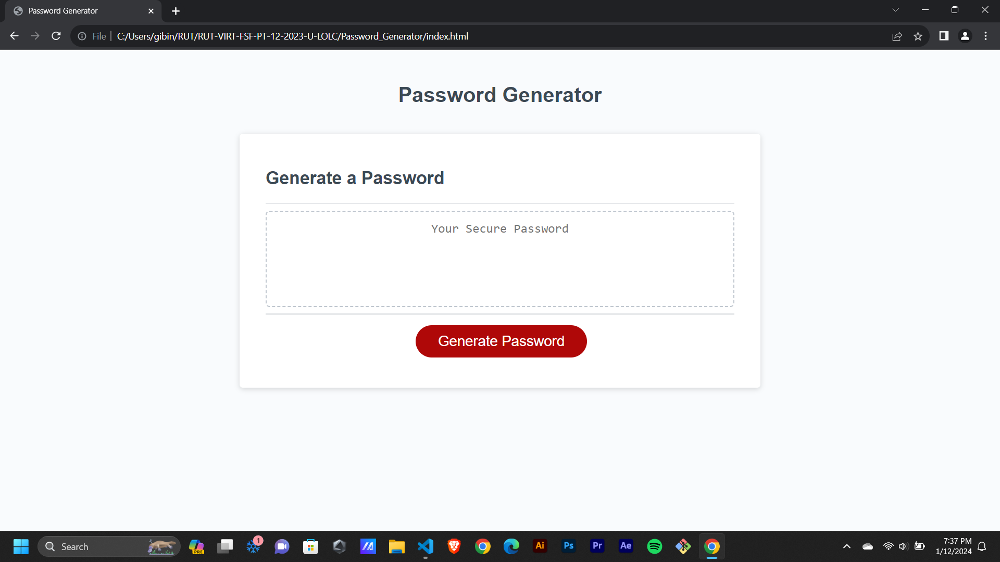
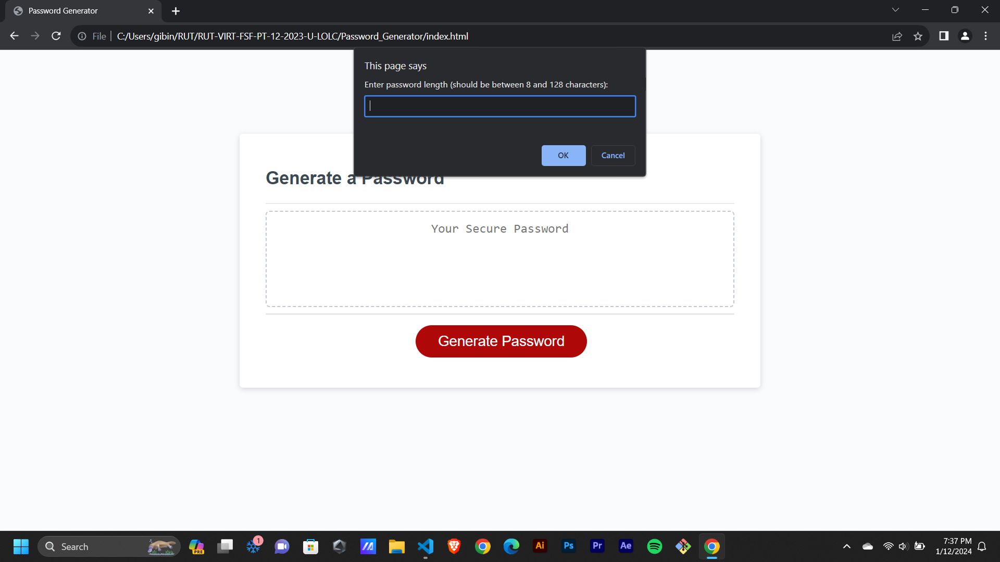
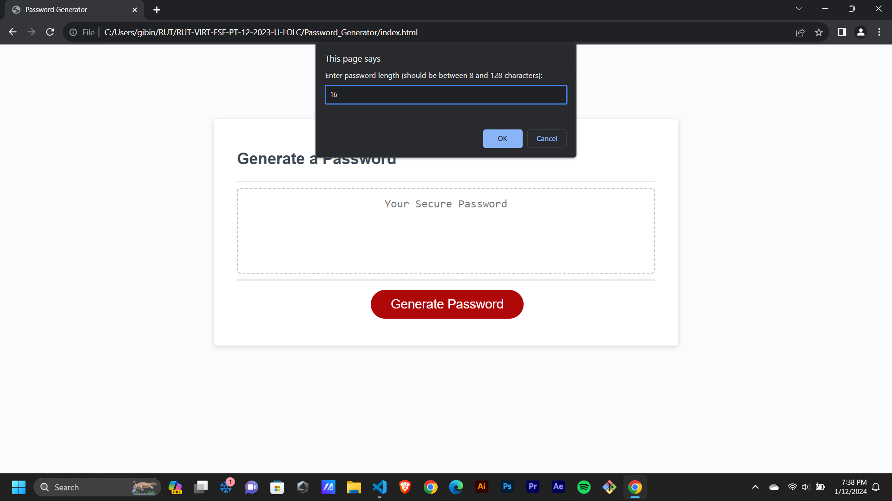
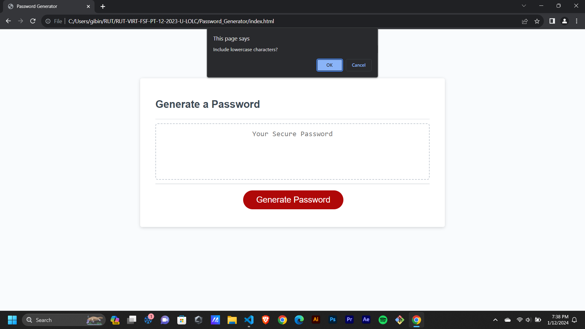

# Password_Generator

This web application will randomly generate a password that meets certain criteria.

When clicked on the button to generate a password, then it will show a series of prompts for password criteria

When prompted for the length of the password, then will need to choose a length of at least 8 characters and no more than 128 characters.

When asked for character types to include in the password, then need confirm whether or not to include lowercase, uppercase, numeric, and/or special characters.

When answered each prompt, then theinput will be validated and with at least one character type will be selected.

When all prompts are answered, then  a password is generated that matches the selected criteria and it displays it.

JavaScript and CSS file is properly commented.

* The URL of the deployed application - https://gibinmgeorge.github.io/Password_Generator/

* The URL of the GitHub repository - https://github.com/GibinMGeorge/Password_Generator

screenshots - 

